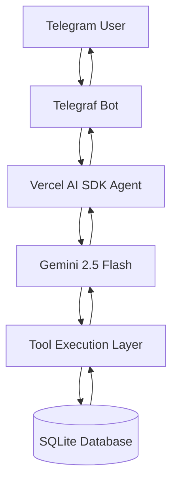
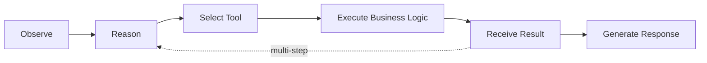

# Supermarket Ops Agent

**An AI agent that runs an Indian kirana store end-to-end, through a single Telegram chat.**

No dashboard. No admin panel. No forms. The chat is the product — the owner receives stock, cuts GST-correct bills, manages customer credit (khata), closes the day, and generates invoices and analysis decks, all in plain shopkeeper English.

---

## Table of Contents

1. [Live Demo](#live-demo)
2. [Overview](#overview)
3. [Harness & Model Choice](#harness--model-choice)
4. [Architecture](#architecture)
5. [Control Loop](#control-loop)
6. [Skill & Tool Design](#skill--tool-design)
7. [How the Hard Parts Are Solved](#how-the-hard-parts-are-solved)
8. [Database Design](#database-design)
9. [Tech Stack](#tech-stack)
10. [Local Setup](#local-setup)
11. [Environment Variables](#environment-variables)
12. [Example Conversations](#example-conversations)
13. [Deliverables](#deliverables)
14. [Future Improvements](#future-improvements)

---

## Live Demo

**Telegram Bot:** [@kirana_super_bot](https://t.me/kirana_super_bot)


---

## Overview

Supermarket Ops Agent is a conversational agent for a small Indian kirana store. The owner talks to it the way they'd talk to a store clerk:

```
What's the stock of Maggi?

Make a bill:
2kg sugar,
1 Aashirvaad atta 5kg,
4 Maggi,
UPI

Put ₹500 on Ramesh's credit

What is Ramesh's khata balance?
```

The model interprets intent and decides which tools to call. It never touches the database directly — every price, stock figure, GST slab, and customer balance is read from and written to SQLite through a fixed set of business tools. This keeps the agent expressive in language while keeping the store's books strictly correct.

---

## Harness & Model Choice

**Vercel AI SDK + Google Gemini 2.5 Flash**

```typescript
import { generateText, stepCountIs } from "ai";
import { google } from "@ai-sdk/google";

const result = await generateText({
  model: google("gemini-2.5-flash"),
  system: buildSystemPrompt(),
  messages: session.history,
  stopWhen: stepCountIs(8),
});
```

This combination was chosen for:

- **Native, strongly-typed tool calling** — tool schemas are defined once (with Zod) and enforced on every call, so the model can't pass malformed arguments into business logic.
- **Multi-step execution in a single turn** — `stopWhen: stepCountIs(8)` lets the agent chain several tool calls (e.g. find product → check stock → add to bill → recompute GST) before responding, which a single-shot request/response model can't do cleanly.
- **Provider flexibility** — the model can be swapped without touching the tool layer or control loop.
- **A thin, inspectable integration** — no framework-specific graph or node abstraction sits between the model and the tools, which matches the brief's instruction to avoid a state-machine-per-command design.

The model's job is limited to understanding intent, selecting tools, and phrasing the final response. It is never the source of truth for prices, stock, GST, or balances.

---

## Architecture



The AI layer never reads or writes the database directly. Every business fact — a price, a stock count, a GST rate, a khata balance — passes through a tool, which is the only place business rules are enforced.

---

## Control Loop



**Example — a stock query:**

1. **Observe:** `What's the stock of Maggi?`
2. **Reason:** the model determines this needs inventory data.
3. **Select tool:** `get_stock_level`
4. **Execute:** the tool queries SQLite for the matching product.
5. **Result:** `120 packets available`
6. **Respond:** *"Maggi 70g currently has 120 packets available."*

For multi-step requests (e.g. a multi-item bill), the loop repeats — the agent calls several tools in sequence within the same turn before producing a final reply.

---

## Skill & Tool Design

Business logic is split into independent tool modules by domain. The model only ever decides *which* tool to call and *with what arguments* — it does not implement any business rule itself.

### Inventory — `src/tools/products.ts`

| Tool | Purpose |
|---|---|
| `add_product` | Register a new SKU (name, unit, HSN code, GST slab, cost, MRP, reorder level) |
| `receive_stock` | Increase inventory on goods received |
| `get_stock_level` | Check current available stock for a product |
| `get_low_stock` | List items at or below reorder level |
| `list_products` | Browse the product catalogue |

### Billing — `src/tools/billing.ts`

| Tool | Purpose |
|---|---|
| `start_bill` | Open a new draft bill for a session |
| `add_item_to_bill` | Add a line item, resolving product + quantity + unit |
| `remove_item_from_bill` | Remove or adjust a line item |
| `get_draft_bill` | Return the current draft for review |
| `finalize_bill` | Lock the bill, decrement stock, and record payment |

### Khata (Customer Credit) — `src/tools/khata.ts`

| Tool | Purpose |
|---|---|
| `khata_add_credit` | Record a credit sale against a customer |
| `khata_record_payment` | Record a settlement against a customer's balance |
| `khata_get_balance` | Return a customer's current outstanding balance |

### Reports & Documents — `src/tools/reports.ts`

| Tool | Purpose |
|---|---|
| `daily_close_summary` | Revenue, tax collected, payment-mode split, top items for the day |
| `generate_invoice_pdf` | Render a finalized bill as a GST-compliant PDF |
| `generate_analysis_deck` | Build a PPTX with charts on sales, stock health, and GST collected |

### Preferences — `src/tools/preferences.ts`

| Tool | Purpose |
|---|---|
| `set_preference` | Store a standing preference (default payment mode, default brand, shop name/GSTIN) |
| `get_preferences` | Read preferences into context when building a response |

---

## How the Hard Parts Are Solved

| Hard part | How it's handled |
|---|---|
| **Grounding** | The model never invents a price, GST slab, stock count, or balance. Every one of these values is fetched from SQLite inside a tool call and returned to the model as fact, not generated. |
| **Oversell guard** | `finalize_bill` checks requested quantity against current stock inside the same DB transaction. If stock is insufficient, the sale is rejected at the tool layer — the prompt is never relied on to "remember" not to oversell. |
| **GST correctness** | Each product carries an HSN code and a tax slab (0% loose staples, 5% packaged staples, 12–18% FMCG). Billing logic computes CGST/SGST split for intra-state sales and produces a rounded, itemized tax breakup — computed entirely in code, not by the model. |
| **Multi-turn bills** | A bill is a stateful draft (`start_bill` → repeated `add_item_to_bill` / `remove_item_from_bill` → `get_draft_bill`). Stock is only touched once, at `finalize_bill`. |
| **Idempotency** | Every Telegram update carries an `update_id`, recorded in `processed_updates` before processing. A redelivered "finalize" is detected and short-circuited, so a retry can never double-bill or double-decrement stock. |
| **Concurrency** | Stock mutations (sale finalization, stock receipt) run inside SQLite transactions with row-level checks, so two bills — or a bill and a stock-in — in flight at once cannot corrupt the stock count. |
| **Guardrails** | Selling below cost, deleting stock outright, or settling a khata balance that doesn't exist are all refused or require explicit confirmation at the tool layer, independent of how the request is phrased. |
| **Real artifacts** | `generate_invoice_pdf` produces an actual GST invoice PDF; `generate_analysis_deck` produces a PPTX with real charts (sales trend, top items, stock health, tax collected) — both generated by tools, not screenshots or plain text dumps. |
| **Memory across sessions** | Two memory layers: conversation memory (per-session chat history, cleared with `/new`) and business memory (SQLite — stock, khata, bills, and owner preferences). Preferences set once (e.g. default payment mode, default brand, shop GSTIN) persist across a `/new` chat because they live in the database, not in context. |

---

## Database Design

**Engine:** SQLite, via `better-sqlite3`

**Tables:**

- `products` — SKU catalogue: name, unit, HSN code, GST slab, cost price, MRP, current stock, reorder level
- `bills` — bill headers: status (draft/finalized), payment mode, reference, totals
- `bill_items` — line items per bill
- `khata_customers` — customer records and running balances
- `khata_txns` — individual credit/payment transactions
- `stock_txns` — stock movement history (received, sold, adjusted)
- `preferences` — standing owner preferences, keyed independently of any single chat session
- `processed_updates` — Telegram `update_id`s already handled, for idempotency

SQLite is the single source of truth. The model holds no business state of its own.

---

## Tech Stack

| Category | Technology |
|---|---|
| AI Model | Google Gemini 2.5 Flash |
| AI Framework | Vercel AI SDK |
| Messaging Platform | Telegram |
| Bot Framework | Telegraf |
| Backend | Node.js + TypeScript |
| Database | SQLite |
| Database Driver | better-sqlite3 |
| Validation | Zod |
| Deployment | Railway |

---

## Local Setup

```bash
# Clone
git clone <repository-url>
cd kirana-agent

# Install dependencies
npm install

# Create database schema
npx tsx src/db/schema.ts

# Seed initial products
npx tsx src/db/seed.ts

# Start the bot
npx tsx src/bot/index.ts
```

Expected output:

```
🤖 Kirana bot is running...
```

---

## Environment Variables

Create a `.env` file:

```
TELEGRAM_BOT_TOKEN=your_bot_token
GOOGLE_GENERATIVE_AI_API_KEY=your_google_ai_key
```

---

## Example Conversations

**Stock query**
```
User: What's the stock of Maggi?
Bot:  Maggi 70g currently has 120 packets available.
```

**Billing**
```
User: Make a bill:
      2kg sugar,
      1 Aashirvaad atta 5kg,
      4 Maggi,
      UPI

Bot:  Draft bill created.
      Subtotal: ₹375.56
      GST:      ₹20.44
      Total:    ₹396

      Please confirm.
```

**Khata**
```
User: Put ₹500 on Ramesh's credit
Bot:  Done. Ramesh's credit balance updated to ₹500.
```

---

## Deliverables

| Requirement | Status |
|---|---|
| Live Telegram bot | ✅ [@kirana_supermarket_bot](https://t.me/kirana_supermarket_bot) |
| Built on a modern agent harness | ✅ Vercel AI SDK + Gemini 2.5 Flash |
| Custom skill/tool surface | ✅ Inventory, billing, khata, reports & documents, preferences |
| PDF invoice generation | ✅ `generate_invoice_pdf` |
| PPTX analysis deck | ✅ `generate_analysis_deck` |
| README | ✅ this document |
| 4–5 min walkthrough recording | _[add link here]_ |

---

## Future Improvements

- Voice-note ordering (transcribe → bill)
- WhatsApp integration alongside Telegram
- Barcode / product-photo identification
- Multi-store support
- Sales-velocity-based reorder suggestions
- Expiry / batch tracking with FEFO
- Scheduled weekly analysis deck, auto-sent
- Multi-language support (Hindi / Tamil)
- Khata payment reminders
